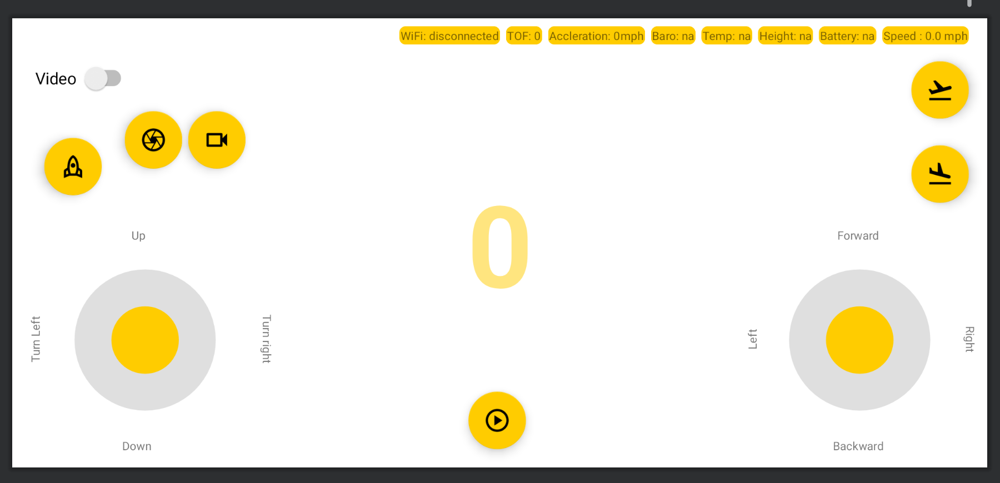

# Tello drone-based object detection app for Android

### This repository will walk you through android app development process for object detection using Tello Drone.

  

  

   

   

### This project will demonstrate how to:
- Create a UI for controlling Tello Drone
- Handle drone using virtual controls
- Process H.264 (AVC) encoded video from Tello and display it on app
- Perform near real-time object detection from Tello video frame

### Things to fix:
- 1.	I could not figure out a way to toggle between and SurfaceView and BitMap displaying for simply viewing video frames vs performing object detection
- 2.	Some of the calculations like drone acceleration etc. needs more attention and correction.
- 3.	Improve the efficiency of the code and simplify it.
- 4.	Closing datagram sockets while not in use or going back to the main page is not working.

### How to install this application?

Open android studio> open demoApplication project > Build > run app (preferably connecting your phone)

### Things to keep in mind:

- While testing on Pixel 4 (Android 12) I faced issues associated with UDP connection. After connecting to Tello's wifi, under internet> wifi> TelloNetworkName> Privacy, there are two options. 1) Use randomized MAC (default) 2) Use device MAC. After connecting to Tello netwok, swith between these options before using the app.
- The above step will disconnect from the wifi and reconnect again, only then will this app work on Pixel 4 (Android 12), this could be only a problem on my device Pixel 4 in general (I don't know it yet)
- There could be several bugs, things could be done in an easier and efficient way, possibly. Please report bugs and issues.
- If you face any issues during development or installation, please raise an issue in my GitHub page for this project

### More importantly, I am excited to see cool application of this project. And finally, if you liked this project and find it interesting, please star the project so that it can reach more people. Thank you and hope you have some fun with this!.

